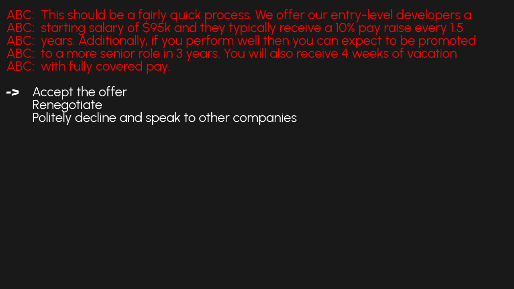

# Recruiting Season

Author: Tejas Srivatsav

Design: As a CS student from CMU, the player must navigate the crazy world of job recruiting. With big tech companies, startups, and trading firms all vying for the student's attention, the student has to optimize for salary, prestige, free time, and career advancement.

Text Drawing: Text is rendered at runtime. TrueType fonts are loaded and processed with harfbuzz into glyphss.

Screen Shot:

How To Play:

The up and down keys are used to move among various options. Use Enter to select your desired option. Press Enter to skip the text animation and display all of it. Press ESC to quit if the game feels too real.

Sources:
Text Drawing is based on code by [Xiaoqiao Xu and Fengying Yang](https://github.com/xuxiaoqiao/game-marios) and [Zhengyang Xia](https://github.com/zhengyangxia/15-466-f20-base4)
Fonts used are variants of [Urbanist](https://fonts.google.com/specimen/Urbanist)

This game was built with [NEST](NEST.md).
